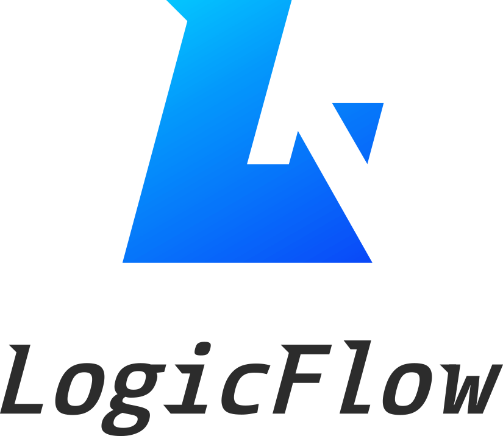

  

[![npm version][npm-v-img]][npm-url]
[![npm download][npm-dl-img]][npm-url]
[![license][license-img]][license-url]

[GitHub](https://github.com/didi/LogicFlow)
[Get Started](README)

[npm-url]: https://www.npmjs.com/package/@logicflow/core
[npm-v-img]: https://img.shields.io/npm/v/@logicflow/core
[npm-dl-img]: https://img.shields.io/npm/dm/@logicflow/core
[license-url]: https://github.com/didi/LogicFlow/blob/master/LICENSE
[license-img]: https://img.shields.io/npm/l/@logicflow/core
