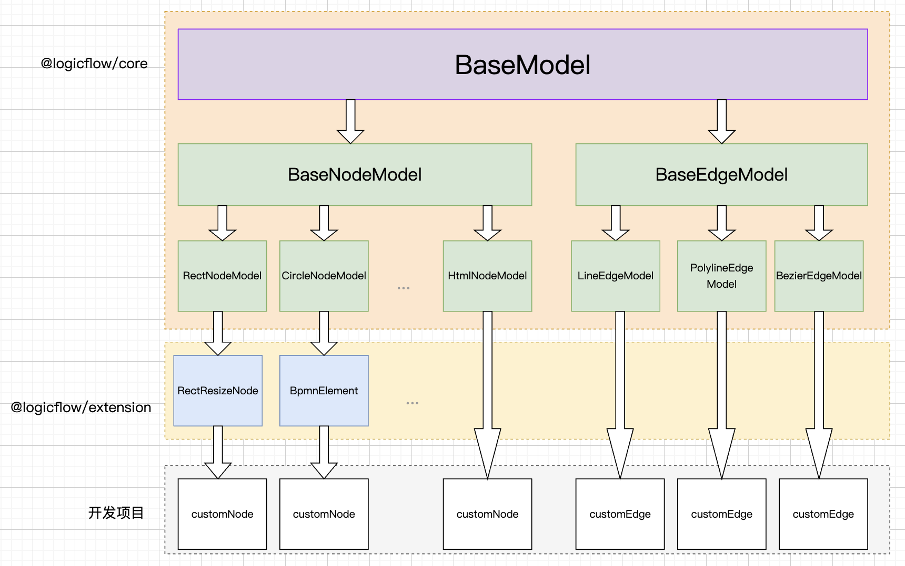

# Node

LogicFlow has some built-in basic nodes. In actual application scenarios, developers can define nodes that conform to their own business logic based on these basic nodes.

## Get to know the basic nodes of LogicFlow

LogicFlow is a flowchart editing framework based on svg, so our nodes and lines are svg basic shapes, and the modification of the LogicFlow node style is also the modification of the svg basic shape.
There are 7 basic nodes in LogicFlow:

- [rect](https://developer.mozilla.org/zh-CN/docs/Web/SVG/Element/rect)
- [circle](https://developer.mozilla.org/zh-CN/docs/Web/SVG/Element/circle)
- [ellipse](https://developer.mozilla.org/zh-CN/docs/Web/SVG/Element/ellipse)
- [polygon](https://developer.mozilla.org/zh-CN/docs/Web/SVG/Element/polygon)
- `diamond`
- [text](https://developer.mozilla.org/zh-CN/docs/Web/SVG/Element/text)
- `html`

Let's see the effect of rendering the base node to the canvas

<a href="https://codesandbox.io/embed/logicflow-step2-spxng?fontsize=14&hidenavigation=1&theme=dark" target="_blank"> Demo in CodeSandBox</a>

## Custom nodes based on class inheritance

The basic nodes of LogicFlow are relatively simple, but there may be various requirements for the appearance of nodes in business. LogicFlow provides a very powerful custom node feature that allows developers to customize various nodes.

?> **Note**
LogicFlow recommends that in actual application scenarios, all nodes use custom nodes, and the type of the node is defined as a name that conforms to the business meaning of the project, instead of using circle and rect that only represent appearance.

LogicFlow is based on class inheritance to implement custom nodes, edges. Developers can inherit LogicFlow's built-in nodes and then use the object-oriented [overriding mechanism](https://baike.baidu.com/item/%E9%87%8D%E5%86%99/9355942?fr=aladdin) to override the node style-related methods to achieve the effect of customizing the node style.


> This diagram was also drawn using LogicFlow. See [graphing tools](https://site.logic-flow.cn/demo/dist/mvp/)。

## Select the base node that the custom node inherits from

There are 7 types of base nodes inside LogicFlow, and you can choose any one of them to inherit when you customize the node, and then take a name that fits your business meaning.

```js
// rectangle
import { RectNode, RectNodeModel } from "@logicflow/core";
// Circle
import { CircleNode, CircleNodeModel } from "@logicflow/core";
// Ellipse
import { EllipseNode, EllipseNodeModel } from "@logicflow/core";
// Polygon
import { PolygonNode, PolygonNodeModel } from "@logicflow/core";
// Diamond
import { DiamondNode, DiamondNodeModel } from "@logicflow/core";
// Text
import { TextNode, TextNodeModel } from "@logicflow/core";
// HTML
import { HtmlNode, HtmlNodeModel } from "@logicflow/core";
```

### Secondary customization

Due to the inheritance-based customization mechanism, LogicFlow also supports secondary customization based on custom nodes. Take the scalable node provided in `@logicflow/extension` as an example.

LogicFlow base node does not support node scaling, so LogicFlow encapsulates the logic for scaling nodes based on the base node in the `extension` package, and then publish it. This allows developers to customize nodes directly based on the scalable nodes in `extension`.

```js
import { RectResize } from "@logicflow/extension";
class CustomNodeModel extends RectResize.model {}
class CustomNode extends RectResize.view {}
```

## Customize a business node

Let's take the example of defining a user task node as shown below to implement a custom node based on the built-in rect node.

### Step 1: Define a node and register it

```js
// UserTaskNode.js
import { RectNode, RectNodeModel } from "@logicflow/core";

class UserTaskModel extends RectNodeModel {}

class UserTaskView extends RectNode {}

export default {
  type: "UserTask",
  view: UserTaskView,
  model: UserTaskModel,
};
```

```js
// main.js
import UserTask from "./UserTaskNode.js";

const lf = new LogicFlow({
  container: document.querySelector("#container"),
});
lf.register(UserTask);

lf.render({
  nodes: [
    {
      type: "UserTask",
      x: 100,
      y: 100,
    },
  ],
});
```

#### `model` and `view`

From the above code, you can see that when customizing a node, we need to define the `model` and `view` of the node. This is because LogicFlow is based on the MVVM pattern, so when customizing nodes and lines, we need to customize `view` and `model`. In most cases, you need to define more complex node appearances by overriding methods related to getting styles on `model` and rewriting `getShape` on `view`.

!> **Tip** LogicFlow was developed based on preact, mobx and MVVM patterns in order to align the development experience with what is popular in front-end development nowadays, and also for better understanding at the code so that more people can participate in it. If you are familiar with react, you can read our source code directly. You can see that the whole project is about as easy to read as your own development project. **We welcome everyone to participate together.**

### Step 2: Customize the node model

LogicFlow divides custom node appearance into `custom node style property` and `custom node shape property`. For more detailed definition methods, please see [NodeModelApi](en/api/nodeModelApi)

#### Customize the style properties of the node

In LogicFlow, the Appearance property controls the `borders`, `colors` of the nodes. These properties are configurable directly through the [theme](en/api/themeApi). Custom node styles can be seen as redefining the current node type based on the theme. For example, in the theme, all `rect` nodes are defined to have a red `stroke: red` border color. Then you can redefine the border to be blue `stroke: blue` when you customize the node `UserTask`.
For a more fine-grained approach to node style control, see [API Style Attributes](en/api/nodeModelApi#StyleAttributes)

```js
class UserTaskModel extends RectNodeModel {
  getNodeStyle() {
    const style = super.getNodeStyle();
    style.stroke = "blue";
    style.strokeDasharray = "3 3";
    return style;
  }
}
```

#### Customize the shape properties of the node :id=custom-shape-properties

In LogicFlow, shape properties represent the node's width `width` and height `height`, the rounded corners of a rectangle `radius`, the radius of a circle `r`, the vertices of a polygon `points`, and other properties that control the final shape of the node. This is because LogicFlow calculates the anchor points of nodes and the start and end points of lines based on shape attributes. For the customization of shape attributes, you need to do it in `setAttributes` method or `initNodeData` method.

Different basic nodes in LogicFlow have unique shape properties. See [API Shape Attributes](en/api/nodeModelApi#ShapeAttributes)

```js
class customRectModel extends RectNodeModel {
  initNodeData(data) {
    super.initNodeData(data);
    this.width = 200;
    this.height = 80;
    this.radius = 50;
  }
}
```

<a href="https://codesandbox.io/embed/epic-cookies-cmqxg?fontsize=14&hidenavigation=1&theme=dark&view=preview" target="_blank"> Demo in CodeSandBox</a>

?> **Note** If you don't set the shape properties in `model`, but define the width and height of the generated graphics directly in `view`, the anchor point position and outline size will be incorrect. At the same time, the position of the line may also be confused.

#### Customizing node styles based on properties

For example, in the approval scenario, the custom approval node has 3 states:

One is the default status that the process has not yet gone to this node, one is the process approval passed status, and one is the rejected status that the approval did not pass. In appearance we need to display different colors for different states. As mentioned in the graph data of LogicFlow, whether it is a node or an edge, LogicFlow reserves the properties field for developers to store their own business attributes. The example is as follows. The `statu` property of `properties` is a custom business property. Developers can control the node to display different styles based on the properties in `properties` when customizing the node style.

```js
class UserTaskModel extends RectNodeModel {
  initNodeData(data) {
    super.initNodeData(data);
    this.width = 80;
    this.height = 60;
    this.radius = 5;
  }
  getNodeStyle() {
    const style = super.getNodeStyle();
    const properties = this.properties;
    if (properties.statu === "pass") {
      style.stroke = "green";
    } else if (properties.statu === "reject") {
      style.stroke = "red";
    } else {
      style.stroke = "rgb(24, 125, 255)";
    }
    return style;
  }
}
```

!> **Tip** If you don't understand why `this.properties` prints out as a Proxy object, and you can't see its properties. Please see issue [https://github.com/didi/LogicFlow/issues/530](https://github.com/didi/LogicFlow/issues/530)

### Step 3: Customize the node view

LogicFlow allows you to define the shape, style, and other properties of a node when you customize the node's `model`. But when developers need a more complex node, they can customize the `view` of node.

```js
class UserTaskView extends RectNode {
  private getLabelShape() {
    const { model } = this.props;
    const { x, y, width, height } = model;
    const style = model.getNodeStyle();
    return h(
      "svg",
      {
        x: x - width / 2 + 5,
        y: y - height / 2 + 5,
        width: 25,
        height: 25,
        viewBox: "0 0 1274 1024"
      },
      h("path", {
        fill: style.stroke,
        d:
          "M655.807326 287.35973m-223.989415 0a218.879 218.879 0 1 0 447.978829 0 218.879 218.879 0 1 0-447.978829 0ZM1039.955839 895.482975c-0.490184-212.177424-172.287821-384.030443-384.148513-384.030443-211.862739 0-383.660376 171.85302-384.15056 384.030443L1039.955839 895.482975z"
      })
    );
  }
  /**
   * Customize node appearance
   */
  getShape() {
    const { model, graphModel } = this.props;
    const { x, y, width, height, radius } = model;
    const style = model.getNodeStyle();
    return h("g", {}, [
      h("rect", {
        ...style,
        x: x - width / 2,
        y: y - height / 2,
        rx: radius,
        ry: radius,
        width,
        height
      }),
      this.getLabelShape()
    ]);
  }
}
```

#### h function

The `h` method is the rendering function exposed by LogicFlow, and its usage is consistent with `react`, `vue`'s [createElement](ttps://cn.vuejs.org/v2/guide/render-function.html#createElement-%E5%8F%82%E6%95%B0). But here we need to create `svg` tags, so we need to have some basic knowledge of svg. But in most cases, we won't involve too complicated knowledge, just simple rectangles, circles, polygons like this.

```js
h(nodeName, attributes, [...children])

// <text x="100" y="100">Text content</text>
h('text', { x: 100, y: 100 }, ['Text content'])

/**
 * <g>
 *   <rect x="100" y="100" stroke="#000000" strokeDasharray="3 3"></rect>
 *   <text x="100" y="100">Text content</text>
 * </g>
 */

h('g',{}, [
  h('rect', { x: 100, y: 100, stroke: "#000000", strokeDasharray="3 3"}),
  h('text', { x: 100, y: 100 }, ['Text content'])
])

```

#### getShape

This method defines the final rendered graphics, and LogicFlow internally inserts the returned content into the svg DOM. Developers do not necessarily need to override this method, but use it only if they expect to change the final rendered graphics svg DOM. In the example above, the final rendered svg DOM of the `rect` node is just a rectangle. But when we want to add an icon to it, we must modify the svg DOM of the final rendered graphics, and this is achieved by overriding `getShape`.

LogicFlow defines the appearance of a node in three ways, **theme**, **custom node model**, **custom node view**. The priority of these three approaches is ` topic < custom node model < custom node view`. Their differences are:

- Theme: Define the common style of all nodes, for example, define the border color, width, etc. of all `rect` nodes.
- Custom node model: Defines the style of the registered type node.
- Custom node view: Defines the svg dom of the registered type node.

?> **Note** Although `custom node view` has the highest priority and the most complete functionality, we can theoretically achieve any effect we want with `custom node view`, but there are still some limitations in this way.

1. The shape attribute of the graph finally generated by `custom node view` must be consistent with the shape attribute in `model`, because the anchor point and outer border of the node are generated based on `width` and `height` in the node model.
2. The overall outline of the final generated shape of `custom node view` must match the inherited base shape. You can't inherit `rect` but return a circle in the getShape function. This is because LogicFlow calculates the position of lines and anchor points based on the base graphics.

#### Why are the `x`,`y` of `rect` not obtained directly from the `model`?

In all LogicFlow base nodes, the `x`,`y` inside the `model` represent the center point uniformly. But the `getShape` method gives us a way to generate the svg dom directly, and in svg, there is a difference in the control over the position of the shape:

- `rect`: The position of the graphic is represented by the coordinates `x`, `y` of the upper left corner. So the coordinates of the upper left corner are generally calculated by subtracting half of the width and height of the node from the center point.

```js
const { x, y, width, height, radius } = this.props.model;
// svg dom <rect x="100" y="100" width="100" height="80">
h("rect", {
  ...style,
  x: x - width / 2,
  y: y - height / 2,
  rx: radius, // Note here is rx instead of radius
  ry: radius,
  width,
  height
}),
```

- `circle` and `ellipse`: indicate the position of the graph by `cx`, `cy`, meaning the coordinates of the center point.

```js
const { x, y, r } = this.props.model;
// svg dom <circle cx="100", cy="100", r="20">
h("circle", {
  ...style,
  r, // Radius
  cx: x,
  cy: y,
});

// ellipse
const { x, y, rx, ry } = this.props.model;
// svg dom <ellipse cx="100", cy="100", rx="20" ry="10">
h("ellipse", {
  ...style,
  cx: x,
  cy: y,
  rx,
  ry,
});
```

- `polygon`: All vertex coordinates already include the position

```js
const { x, y, points } = this.props.model;
const pointStr = points
  .map((point) => {
    return `${point[0] + x}, ${point[1] + y}`;
  })
  .join(" ");
// svg dom <polygon points="100,10 250,150 200,110" >
h("polygon", {
  ...style,
  r, // Radius
  points: pointStr,
});
```

!> **How to set the radius when customizing the view of a rectangle** In `model`, `radius` is the shape property of the rectangle node. However, when customizing the `view`, it should be noted that the rounded corners of the rectangle in svg are not set with `radius`, but with [rx](https://developer.mozilla.org/zh-CN/docs/Web/SVG/Attribute/rx), ry. So when you customize the rectangle of `view`, you need to assign the `radius` of the model to `rx` and `ry`, otherwise the rounded corners will not take effect.

#### props

LogicFlow is developed based on `preact`. When we customize the node view, we can get the data passed from the parent component through `this.props`. The `this.props` object contains two properties, which are:

- `model`: represent the model of the custom node
- [graphModel](en/api/graphModelApi): represent the model of the entire graph of logicflow

#### How to get the path of the icon

In general, for icons we can look for UI or go to [iconfont.cn](https://www.iconfont.cn/) to get a file in svg format. Then open it as text in the IDE and format it to see the code.

The code generally has an outermost svg tag and one or more paths inside. At this time, we can use the `h` method mentioned above to implement the code in the svg file.

The svg tag generally includes the following attributes:

- `viewBox`: The [viewBox](https://developer.mozilla.org/zh-CN/docs/Web/SVG/Attribute/viewBox) property allows to specify a given set of graphical stretches to fit a specific container element. It is generally sufficient to copy the value of the `viewBox` property from the svg tag.
- `width` and `height`: Instead of using the `width` and `height` on the svg tag, just write the width and height as you expect.

Attributes of the path tag:

- `d`: This property defines a path. Just copy the svg code over, and don't worry about what d means.
- `fill`: Indicates the fill color of the path. Generally the same as the node border color, but can also be customized according to business needs.

<a href="https://codesandbox.io/embed/logicflow-step3-mhge5?fontsize=14&hidenavigation=1&theme=dark&view=preview" target="_blank"> Demo in CodeSandBox</a>

## Custom edge connection rules

At some point, we may need to control how the edges are connected, such as the start node cannot be connected by other nodes, the end node cannot be connected to other nodes, the user node must be followed by a judgment node, etc. To achieve this effect, we need to set the following two properties for the node:

- `sourceRules` - Validation rules when the node is the starting node (source) of an edge
- `targetRules` - Validation rules when the node is the target node (target) of the edge

Take square as an example, we want its next node to be a circle node only, then we should add validation rules to `square` as a `source` node.

```ts
import { RectNode, RectNodeModel } from "@logicflow/core";
class SquareModel extends RectNodeModel {
  initNodeData(data) {
    super.initNodeData(data);

    const circleOnlyAsTarget = {
      message: "The next node of a square node can only be a circular node",
      validate: (sourceNode, targetNode, sourceAnchor, targetAnchor) => {
        return targetNode.type === "circle";
      },
    };
    this.sourceRules.push(circleOnlyAsTarget);
  }
}
```

In the above example, we added a validation rule to the `sourceRules` property of `model`. The validation rule is an object for which we need to provide the `messgage` and `validate` properties.

The `message` attribute is the error message thrown when the validation rule is not satisfied, and `validate` is the callback function that triggers the validation or not. The `validate` method has two parameters, the start node (source) and the target node (target) of the edge. We can decide whether to pass the validation based on the parameter information, and its return value is a Boolean value.

> When we operate on the edges on the panel, LogicFlow will verify each rule, and only after **all** of them pass can we connect.

When adding an edge, if the custom rule is not passed after the mouse is released (the return value of the `validate` method is `false`), LogicFlow will throw the event `connection:not-allowed` externally.

```js
lf.on("connection:not-allowed", (msg) => {
  console.log(msg);
});
```

**Set the style of the node in different states**

In the node model, there is a state attribute. When the node connection rule check fails, the state attribute value is 5. We can use this attribute to realize the prompt effect of the node when connecting.

<a href="https://codesandbox.io/embed/long-star-d4j86e?fontsize=14&hidenavigation=1&theme=dark&view=preview" target="_blank"> Demo in CodeSandBox</a>

## Restrict node movement

Sometimes, we need to control when nodes can move and when they cannot. For example, when implementing a grouping plug-in, you need to control that the children of a grouping node are not allowed to move out of the group.

Similar to the concatenation rules, we can add rule functions to the node's `moveRules`.

```ts
class MovableNodeModel extends RectNodeModel {
  initNodeData(data) {
    super.initNodeData(data);
    this.moveRules.push((model, deltaX, deltaY) => {
      // Not allowed to move to a place with negative coordinates
      if (
        model.x + deltaX - this.width / 2 < 0 ||
        model.y + deltaY - this.height / 2 < 0
      ) {
        return false;
      }
      return true;
    });
  }
}
```

Adding global move rules is supported in `graphModel`, e.g. when moving A node, expect to move B node with it.

```js
lf.graphModel.addNodeMoveRules((model, deltaX, deltaY) => {
  // If a group is moved, then the children of the group are moved along with it.
  if (model.isGroup && model.children) {
    lf.graphModel.moveNodes(model.children, deltaX, deltaY, true);
  }
  return true;
});
```

<a href="https://codesandbox.io/embed/exciting-galileo-18sm6?fontsize=14&hidenavigation=1&theme=dark&view=preview" target="_blank"> Demo in CodeSandBox</a>

## Custom anchor points of nodes

For various base type nodes, we have built-in default anchor points. LogicFlow implements custom anchors of nodes by overriding the method for getting anchors.

```ts
import { RectNode, RectNodeModel } from "@logicflow/core";

class SquareModel extends RectNodeModel {
  initNodeData(data) {
    super.initNodeData(data);

    const rule = {
      message: "Only allow connection from the right anchor point",
      validate: (sourceNode, targetNode, sourceAnchor, targetAnchor) => {
        return sourceAnchor.name === "right";
      },
    };
    this.sourceRules.push(rule);
  }
  getAnchorStyle(anchorInfo) {
    const style = super.getAnchorStyle(anchorInfo);
    if (anchorInfo.type === "left") {
      style.fill = "red";
      style.hover.fill = "transparent";
      style.hover.stroke = "transpanrent";
      style.className = "lf-hide-default";
    } else {
      style.fill = "green";
    }
    return style;
  }
  getDefaultAnchor() {
    const { width, height, x, y, id } = this;
    return [
      {
        x: x - width / 2,
        y,
        type: "left",
        edgeAddable: false, // Controls if the link can be created manually from this anchor. Default is true.
        id: `${id}_0`,
      },
      {
        x: x + width / 2,
        y,
        type: "right",
        id: `${id}_1`,
      },
    ];
  }
}
```

In the above example, when we customize the anchor points, we can not only define the number and position of the anchor points, but also add any attributes to the anchor points. With these extra attributes, we can then do many additional things. For example, we add a rule that allows the right side of the node to only connect out, and the left side to only connect in; Or add an id, to save which two anchor points are currently connected when fetching data.

?> **Note** Make sure that the id of the anchor is unique, otherwise there may be problems with inaccurate validation of the connecting rules.

<a href="https://codesandbox.io/embed/logicflow-base15-ou2i0?fontsize=14&hidenavigation=1&theme=dark&view=preview" target="_blank"> Demo in CodeSandBox</a>

!> **Tip** In actual development, there may be a need to hide anchor points, you can refer to the github issue [How to hide anchor points?](https://github.com/didi/LogicFlow/issues/454)，You can see code sandbox [Example](https://codesandbox.io/s/reverent-haslett-dkb9n?file=/step_14_hideAnchor/index.js)

## Custom node text

LogicFlow supports customizing the appearance and editing state of node text. Refer `textObject` in [nodeModel API](en/api/nodeModelApi)

```js
class CustomNodeModel extends RectNodeModel {
  initNodeData(data) {
    super.initNodeData(data);
    this.text.draggable = false; //Do not allow text to be dragged
    this.text.editable = false; // Do not allow text to be edited
  }
  getTextStyle() {
    const style = super.getTextStyle();
    style.fontSize = 16;
    style.color = "red";
    return style;
  }
}
```

## Custom HTML nodes

The basic HTML node built into LogicFlow is different from other basic nodes, and we can use LogicFlow's customization mechanism to implement various forms of HTML nodes. HTML nodes can be rendered using any framework.

```ts
class UmlModel extends HtmlNodeModel {
  setAttributes() {
    this.text.editable = false; // Disallow editing node text
    // Set the width and height and the anchor points of the node
    const width = 200;
    const height = 130;
    this.width = width;
    this.height = height;
    this.anchorsOffset = [
      [width / 2, 0],
      [0, height / 2],
      [-width / 2, 0],
      [0, -height / 2],
    ];
  }
}
class UmlNode extends HtmlNode {
  currentProperties: string;
  setHtml(rootEl: HTMLElement) {
    const { properties } = this.props.model;

    const el = document.createElement("div");
    el.className = "uml-wrapper";
    const html = `
      <div>
        <div class="uml-head">Head</div>
        <div class="uml-body">
          <div>+ ${properties.name}</div>
          <div>+ ${properties.body}</div>
        </div>
        <div class="uml-footer">
          <div>+ setHead(Head $head)</div>
          <div>+ setBody(Body $body)</div>
        </div>
      </div>
    `;
    el.innerHTML = html;
    // The previously rendered child nodes need to be cleared out first.
    rootEl.innerHTML = "";
    rootEl.appendChild(el);
  }
}
```

### Creating html nodes with react

Since the custom html node exposes a DOM node to the public, you can use the framework's existing capabilities to render the node. In react, we use the `render` method of `reactDom` to render the react component to the dom node.

```jsx
import { HtmlNodeModel, HtmlNode } from "@logicflow/core";
import React from "react";
import ReactDOM from "react-dom";
import "./uml.css";

function Hello(props) {
  return (
    <>
      <h1 className="box-title">title</h1>
      <div className="box-content">
        <p>{props.name}</p>
        <p>{props.body}</p>
        <p>content3</p>
      </div>
    </>
  );
}

class BoxxModel extends HtmlNodeModel {
  setAttributes() {
    this.text.editable = false;
    const width = 200;
    const height = 116;
    this.width = width;
    this.height = height;
    this.anchorsOffset = [
      [width / 2, 0],
      [0, height / 2],
      [-width / 2, 0],
      [0, -height / 2],
    ];
  }
}
class BoxxNode extends HtmlNode {
  setHtml(rootEl: HTMLElement) {
    const { properties } = this.props.model;
    ReactDOM.render(
      <Hello name={properties.name} body={properties.body} />,
      rootEl
    );
  }
}

const boxx = {
  type: "boxx",
  view: BoxxNode,
  model: BoxxModel,
};

export default boxx;
```

```jsx
// page.jsx

import box from './box.tsx';
export default function PageIndex() {
  useEffect(() => {
    const lf = new LogicFlow({
      ...config,
      container: document.querySelector('#graph_html') as HTMLElement
    });
    lf.register(box);
    lf.render({
      nodes: [
        {
          id: 11,
          type: 'boxx',
          x: 350,
          y: 100,
          properties: {
            name: 'turbo',
            body: 'hello'
          }
        },
      ]
    });
    lf.on('node:click', ({ data}) => {
      lf.setProperties(data.id, {
        name: 'turbo',
        body: Math.random()
      })
    });
  }, []);

  return (
    <>
      <div id="graph_html" className="viewport" />
    </>
  )
}
```

### Example of a custom HTML node

<a href="https://codesandbox.io/embed/logicflow-step7-dpmgb?fontsize=14&hidenavigation=1&module=%2Fstep7%2FcustomNode.js&theme=dark&view=preview" target="_blank"> Demo in CodeSandBox</a>
