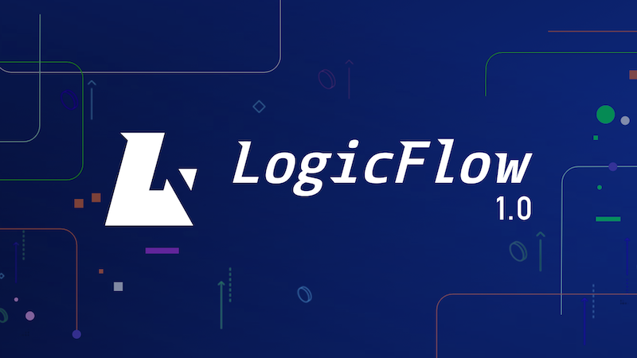
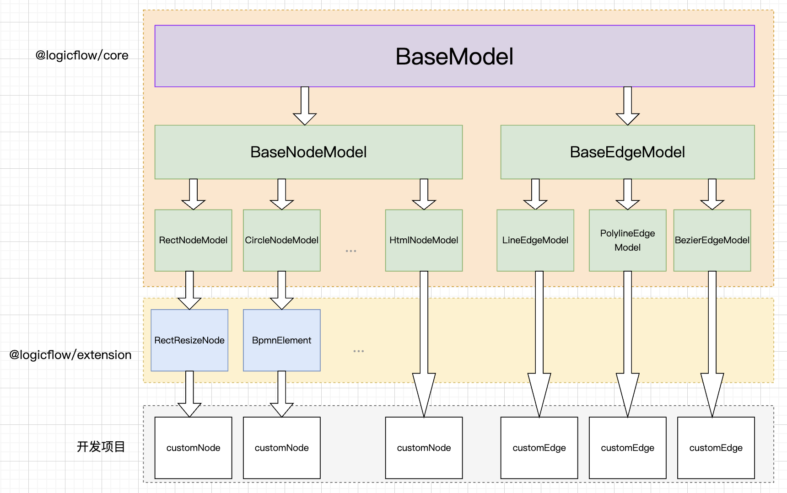
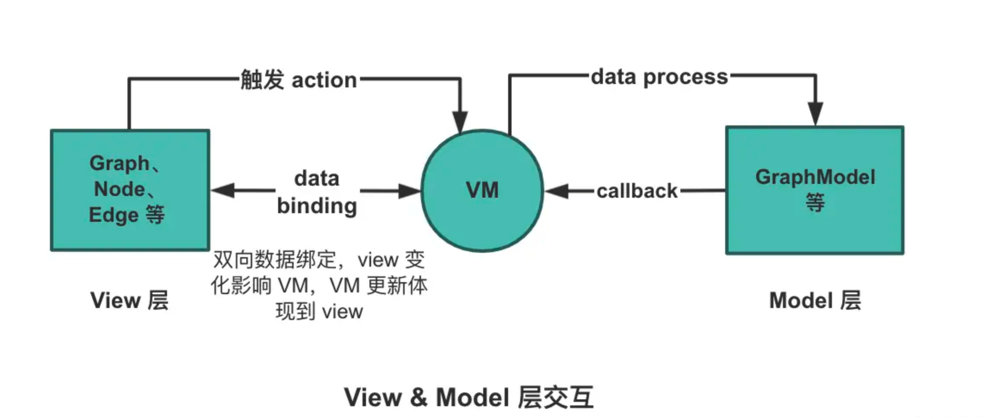
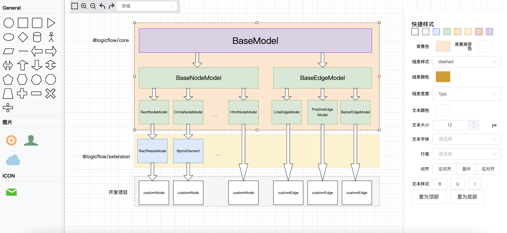

# LogicFlow发布1.0版本

就在2021年12月31日，我们发布了LogicFlow 1.0版本。LogicFlow是一款**流程图编辑框架**，提供了一系列流程图交互、编辑所需的功能和灵活的自定义节点、边、插件等拓展机制，可以支持研发各种逻辑编排场景，如流程图、脑图、BPMN流程等。

在2020年的12月31日，我们开源了LogicFlow的v0.1。在开源的这一年里，我们基于社区反馈，对LogicFlow进行不断的打磨，终于在LogicFlow开源一周年时，发布了LogicFlow的v1.0。

## LogicFlow的特点

### 基于继承的自定义机制

LogicFlow的自定义机制是基于继承来实现。开发者可以继承LogicFlow内置的节点、边，然后利用面向对象的重写机制。重写样相关的方法，来达到自定义节点的效果。
以下是LogicFlow自定义model示例图（PS: 此图也是用LogicFlow绘制）:

LogicFlow中要想自定义一个节点，不仅需要定义这个节点的model, 还需要利用这种继承方式来自定义节点的view，这是因为LogicFlow采用mvvm这种开发模式。

### 基于mvvm的开发模式

LogicFlow为了开发的时候将开发体验和现在前端流行的开发体验对齐，也为了在代码层面更好的理解，让更多的人可以参与进来，我们选择了在前端工程发应用非常广泛的MVVM模式进行开发。定义图的 View 和 Model 层，同时将视图更新交给框架来做，使工程代码具备一定的解耦。如果大家熟悉react开发的话，可以直接阅读我们的源码，你们可以发现整个项目阅读起来难度和您平时开发的业务系统差不多。

> 我们欢迎大家一起参与进来。不论您是修改了文档标点还是重构了我们一个模块，都可以给我们提PR，我们会认真对待您的每一个commit。

以下是 LogicFlow 图编辑器的 MVVM 示意图：

### 所有非核心功能插件化支持

LogicFlow发布代码分为@logicflow/core和@logicflow/extension两个包，其中core包仅包含图编辑的核心功能和对外暴露的图编辑API。而对于非图编辑的功能，例如**菜单**、**控制栏**、**导航**、**bpmn支持**、**节点缩放**等都是以插件的形式提供在extension包中。在实际应用中，可以按照自己的产品逻辑自由选择插件，如果觉得插件不满意，也完全可以基于自己的需求重新实现一个。

## LogicFlow场景示例

LogicFlow开发的核心思想之一是高扩展性。我们开发LogicFlow的初衷就是在流程图相关的业务上，让前端不再成为业务的瓶颈。下面是我们实现的部分示例：

### bpmn示例

LogicFlow 实现了**BPMN**扩展，可以直接使用 LogicFlow 来绘制兼容 BPMN2.0 规范的流程，并且其导出的数据可以在 Activiti 流程引擎上运行。

> 地址: [http://logic-flow.org/usage/bpmn.html](http://logic-flow.org/mvp/index.html)

示例图如下:

### 作图工具示例

LogicFlow不仅支持开发类似bpmn.js这种固定整体样式、更偏向生成数据在流程引擎可执行的流程图工具。也支持实现类似ProcessOn这种自由控制样式的作图工具。

> 地址：[http://logic-flow.org/mvp/index.html](http://logic-flow.org/mvp/index.html)

示例图如下:

### 审批流示例

这里是我们在react项目中实现的审批流示例

> 地址：[http://logic-flow.org/usage/approve.html](http://logic-flow.org/usage/approve.html)

示例图如下:

### 自定义场景

这里是我们在vue项目中实现的自定义场景示例

> 地址：[https://github.com/xinxin93/logicflow_vue_demo](https://github.com/xinxin93/logicflow_vue_demo)

## LogicFlow未来规划

LogicFlow项目开源已经满1年，在未来仍然还有很多事情要做，在2022年我们会继续作为迭代维护LogicFlow，近期我们的重点在BPMN功能对齐、产品化、引擎化这些方向发力：

- BPMN功能对齐主要是我们目前内置的bpmn元素只支持bpmn 2.0中的基础能力，后续我们会继续增加子流程、边界事件、中间事件等功能。
- 产品化方面，我们打算基于LogicFlow的能力来孵化一款开箱即用的流程图作图工具。也就是上面作图工具示例。
- 引擎化方面，我们将提供一款JS版的流程执行引擎，让前端具备“编辑流程 => 流程数据 => 执行流程”这一整套技术栈，完善我们的技术生态，也希望赋能有闭环业务实现诉求的前端团队。

## 最后

LogicFlow整体来说还是一个比较新的框架，请大家多一点耐心，也欢迎大家一起参与进来，帮助我们发现问题，一起共建。对于 LogicFlow 技术本身的实现细节、对于相似业务的探讨、使用LogicFlow遇到的问题也都欢迎大家进群来交流。

-   LogicFlow 官方网站： [http://logic-flow.org](http://logic-flow.org)
-   github 仓库地址：[https://github.com/didi/LogicFlow](https://github.com/didi/LogicFlow)
-   添加微信号进用户群： logic-flow